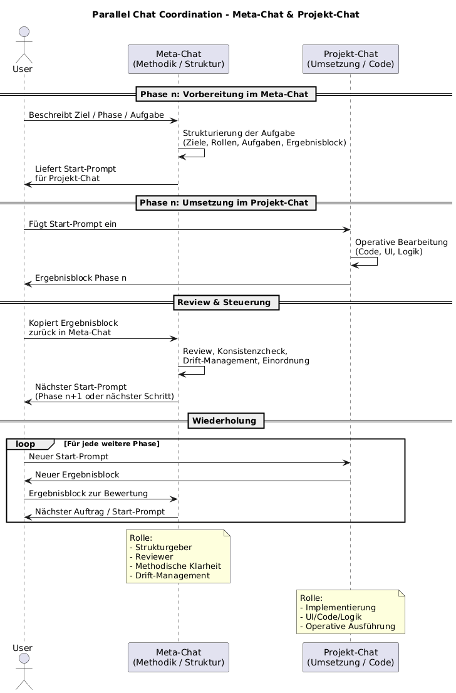

# Parallel Chat Coordination  

Dieses Dokument beschreibt den strukturierten Einsatz **zweier paralleler ChatGPT-Kontexte** im Rahmen der ALOT2COME-Methodik. Dieses Vorgehen wurde erfolgreich im Beispielprojekt *Prompt-Generator WebApp* demonstriert.

# 1. Zweck des Ansatzes
Komplexere Vorhaben profitieren von einer klaren Trennung der Rollen und Aufgaben, die ein LLM übernehmen soll. Das wird durch die Nutzung zweier paralleler Chats erreicht:

- **Meta-Chat:** Denkraum für Struktur, Qualität, Methode  
- **Projekt-Chat:** Ausführender Arbeitsraum für Umsetzung, Code, UI, Inhalte

Dies verhindert Drift, Scope-Vermischung und Kontextüberladung.

# 2. Rollenverteilung
In diesem Beispiel wird die Zusammenarbeit mit dem LLM bewusst in zwei getrennte Chat-Formen aufgeteilt: einen Meta-Chat und einen Project-Chat. Diese Trennung verhindert Rollen- und Kontextdrift und stellt sicher, dass methodische Entscheidungen nicht mit der operativen Arbeit vermischt werden. Während der Meta-Chat den Rahmen setzt, steuert und stabilisiert, konzentriert sich der Project-Chat ausschließlich auf die inhaltliche oder technische Umsetzung. Dadurch bleibt die Arbeit in beiden Chats klar strukturiert, kontrolliert und reproduzierbar.

## Meta-Chat
Der Meta-Chat dient der methodischen Steuerung eines Projekts: Hier werden Struktur, Vorgehen, Rollen, Drift-Kontrolle, Startprompts, Persistenz und Qualitätsentscheidungen besprochen und geklärt. Er definiert den Rahmen, in dem der Project-Chat operativ arbeitet.

Verantwortlich für:
- Strukturierung des Vorhabens  
- Definition von Phasen, Startprompts und Aufgaben  
- Qualitätskontrolle & Konsistenz  
- Drift-Erkennung und -Korrektur  
- Erzeugung repo-fähiger Ergebnisblöcke  
- Dokumentation & Reflexion  
- methodische Klarheit  

Nicht zuständig für:
- Code  
- UI-Design  
- Implementierungsdetails  
- operative Ausführung  

## Projekt-Chat
Der Project-Chat ist der operative Arbeitsraum, in dem die eigentliche inhaltliche oder technische Umsetzung erfolgt — etwa die Entwicklung einer WebApp, das Schreiben eines Textes oder die Ausarbeitung eines Modells. Er folgt den methodischen Leitplanken des Meta-Chats und konzentriert sich ausschließlich auf die konkrete Aufgabe.

Verantwortlich für:
- operative Umsetzung  
- Code, UI, Logik  
- Anwendung der Phase-Startprompts  
- Erstellung funktionsfähiger Ergebnisse  
- Moduldesign, Einhaltung der technischen Struktur  

Nicht zuständig für:
- Methodik  
- Meta-Entscheidungen  
- Prozessdefinition  

# 3. Ablauf (High-Level)

Der Ablauf folgt einem zyklischen Muster:

```
Meta-Chat  →  Projekt-Chat  →  Meta-Chat  →  Projekt-Chat  → …
```

1. Meta-Chat bereitet **Startprompt** für eine Aufgabe vor  
2. Projekt-Chat führt aus, liefert **Ergebnisblock**  
3. Meta-Chat prüft & konsolidiert  
4. Meta-Chat erzeugt nächste Aufgabe  
5. Projekt-Chat setzt um  
6. Wiederholen bis Abschluss

# 4. Ablaufschritte im Detail

Die Grafik zeigt, wie bei cher-alot2come zwei getrennte Chats zusammenarbeiten:
Der **Meta-Chat** strukturiert das Vorgehen, definiert Aufgaben und erstellt Startprompts.
Der **Projekt-Chat** führt diese Aufgaben operativ aus und liefert Ergebnisblöcke zurück.

Der Nutzer wechselt zwischen beiden Chats, indem er Startprompts in den Projekt-Chat überträgt und Ergebnisblöcke zur Überprüfung in den Meta-Chat zurückführt.
Dieser zyklische Ablauf — Strukturierung → Umsetzung → Review — wird für jede Phase wiederholt und sorgt für Klarheit, Driftsicherheit und saubere Ergebnisse.


(vgl. [Prozessablauf](./data/parallel-chat-coordination.uml))

## Schritt 1 – Strukturierte Aufgabe im Meta-Chat formulieren
Meta-Chat erstellt:
- Ziel der Phase  
- Aufgabenliste  
- Rahmenbedingungen  
- Rollen  
- erwarteten Ergebnisblock

## Schritt 2 – Startprompt in Projekt-Chat übertragen
Der Prompt wird **unverändert** kopiert.  
Projekt-Chat übernimmt operative Rolle.

## Schritt 3 – Operative Ausführung im Projekt-Chat
Der Projekt-Chat liefert:
- Code  
- UI-Komponenten  
- Module  
- strukturierte Ergebnisblöcke  
- technische Entscheidungen  

## Schritt 4 – Ergebnis zurück in Meta-Chat zur Bewertung
Meta-Chat übernimmt:
- Qualitätscheck  
- Strukturvalidierung  
- Driftprüfung  
- methodische Einordnung  

## Schritt 5 – Nächsten Arbeitsauftrag definieren
Basierend auf dem Review generiert der Meta-Chat:
- neuen Startprompt  
- neue Aufgabenliste  
- nächste Phase  

# 5. Beispiel aus dem Prompt-Generator-Projekt

| Phase | Meta-Chat | Projekt-Chat |
|-------|-----------|--------------|
| Phase 1 | Projektdefinition, Scope | Projektstruktur |
| Phase 2 | Problemrahmen | Datenmodell |
| Phase 3 | Setup definieren | HTML/JS-Gerüste |
| Phase 4 | Konsolidierungsauftrag | Event-Handling, Rendering |
| Phase 5 | Feinschliff | UX, Responsiveness |
| Phase 6 | Abschlussrahmen | Finalisierung, Release |

Die detaillierte Kommunikation zwischen diesen beiden Chats wurde [hier](../../docs/examples/promp-generator-collaboration.md) aufgezeichnet.

# 6. Drift-Management in parallelen Chats

Typische Drifts:
- Vermischung von Code im Meta-Chat  
- Vermischung von Methode im Projekt-Chat  
- Begriffsvarianten  
- Rollenabweichungen  

Korrekturmechanismen:
- explizite Klarstellung der Rollen  
- Startprompts zur Re-Fokussierung  
- Bezug zu Datenmodell / Glossar  
- Phasen-Grenzen bewusst einhalten  

# 7. Persistenz & Ergebnisblöcke

Projekt-Chat liefert:
- **technische Ergebnisblöcke**

Meta-Chat liefert:
- **methodische Abschlussblöcke**

Beide landen getrennt:
- technische Artefakte → Projekt-Repo  
- methodische Artefakte → Methoden-Repo  

# 8. Vorteile des Parallel-Chat-Modells

- minimiert Drift  
- verhindert kognitive Überlastung  
- klare Rollentrennung  
- reproduzierbare Ergebnisse  
- mehr Struktur & Arbeitsgeschwindigkeit  
- unterstützt langfristige LLM-Projekte  

# 9. Best Practices

- Jeder Chat hat **eine einzige** Rolle  
- Startprompts klar und vollständig  
- Ergebnisblöcke eindeutig benannt  
- Phasen sauber markieren  
- nichts „zwischen den Chats vermischen“  
- Rollen im Zweifel explizit neu aktivieren  

# 10. Fazit

Das Parallel-Chat-Modell ist ein entscheidender Baustein der cher-alot2come-Methode. Es verbessert Fokus, Klarheit, Qualität und Reproduzierbarkeit komplexer KI-gestützter Projekte. Das Beispielprojekt *Prompt-Generator* bestätigt die Praxistauglichkeit dieses Ansatzes.
